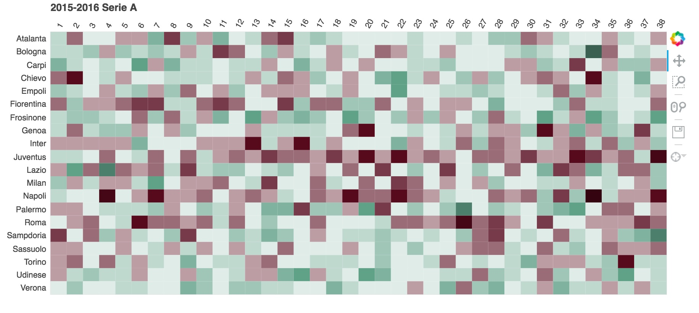

##### (the interactive version of this chart can be seen by opening 'df_plot.html' in a browser)

Dongjie, this is a really neat visualization! It's an interesting alternative approach to visualizing time series. I think the graph does a great job of showing a *qualitative narrative* for each of the soccer teams' seasons.

This type of visualization would do a good job of showing *clustering patterns* amongst the different soccer teams, over the course of their seasons. In that regard, one recommendation would be to vertically order the teams in some fashion other than alphabetical that would bring out some interesting insights about the storylines of each team with respect to each other.

My second recommendation is simply to add more clarity with labels/titles so that it's immediately clear what the viewer is looking at. What is on the y-axis? What do the numbers on the x-axis represent? You included this explanation in the github markdown file, but it would be great to see some more information on the visualization itself.

Nice touch with the information presented on hover that lets a viewer dig into quantitative details if necessary.
