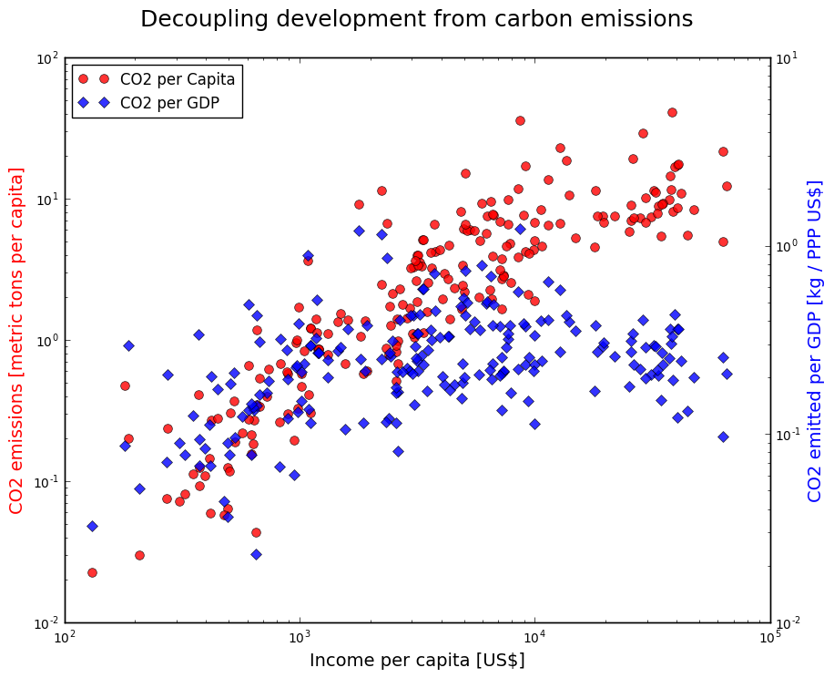

 

This plot is made by Victor and it's easy to read and understand the purpose of this visualization work. With detailed data wrangling process and clear notes, this plot is strongly demonstrate the relationship between Income per capita and CO2 emissions per capita and per GDP.

The colors Victor choses are intuitive for readers and its fontsize and ranges of axis are appropriate as well. With accurate title, labels and legend, it includes all necessary elements of a research plot. If Victor can make the background with grid, I think it could be better.

For the content, this plot is informative and without any redundant information. One suggestion is that Victor can draw the central fitted line (e.g. regression fitted line) for each dataset to measure the trends. Also he can draw a vertical line $x=10^4​$. I think, it would be helpful to explain how he draw conclusions from the plot. 
